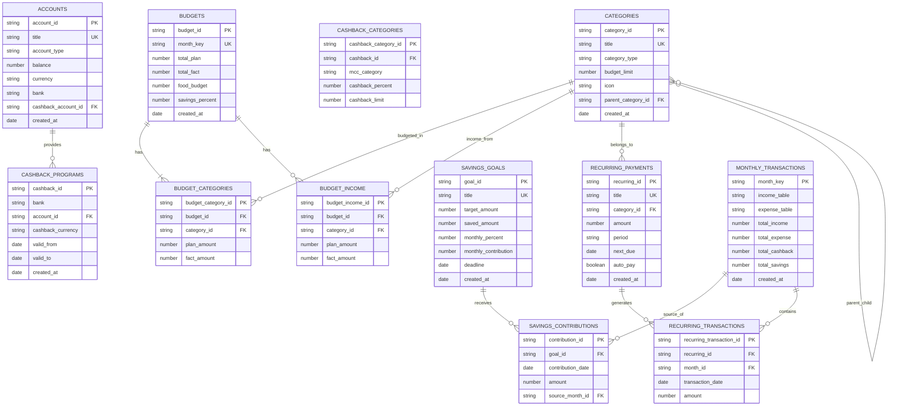

---
tags:
  - финансы
  - schema
  - database
aliases:
  - Схема базы финансов
  - DB Schema Wallet
---

# Schema

Это нормализованная схема проекта Кошелек в терминах БД.

Canvas-версия: [[Schema.canvas]]

Главный принцип чтения:

1. каждая папка-таблица хранит записи одного типа;
2. каждая заметка внутри такой папки = одна строка таблицы;
3. прямых many-to-many в логической схеме нет;
4. связи many-to-many всегда раскладываются через отдельные связующие таблицы.

---

## Карта проекта

### Физические таблицы

| Папка | Таблица | Одна заметка = |
| --- | --- | --- |
| `Accounts/` | `accounts` | один счёт |
| `Categories/` | `categories` | одна категория |
| `Cashback/` | `cashback_programs` | одна программа кешбека |
| `Budgets/` | `budgets` | один месячный бюджет |
| `Savings/` | `savings_goals` | одна цель накоплений |
| `Recurring/` | `recurring_payments` | один регулярный платёж |
| `Monthly/` | `monthly_transactions` | транзакции одного месяца (временная таблица) |

### Логические связующие таблицы

| Таблица | Что связывает | Одна запись = |
| --- | --- | --- |
| `budget_categories` | `budgets` <-> `categories` | одна категория в одном бюджете |
| `budget_income` | `budgets` <-> `categories(income)` | один источник дохода в бюджете |
| `savings_contributions` | `savings_goals` <-> `monthly_transactions` | один взнос в цель |
| `recurring_transactions` | `recurring_payments` <-> `monthly_transactions` | одно списание регулярного платежа |

---

## ER Schema



---

## Tables

### `accounts`

Справочник счетов.

| Поле | Тип | Null | Ключ | Смысл |
|---|---|---|---|---|
| `account_id` | string | нет | PK | идентификатор счёта |
| `title` | string | нет | UK | название счёта |
| `account_type` | string | нет | | тип: карта/наличные/накопительный |
| `balance` | number | нет | | текущий баланс |
| `currency` | string | нет | | валюта |
| `bank` | string | да | | название банка |
| `cashback_account_id` | string | да | FK -> `cashback_programs.cashback_id` | привязанный кешбек |
| `created_at` | date | нет | | дата создания |

### `categories`

Справочник категорий расходов и доходов.

| Поле | Тип | Null | Ключ | Смысл |
|---|---|---|---|---|
| `category_id` | string | нет | PK | идентификатор категории |
| `title` | string | нет | UK | название категории |
| `category_type` | string | нет | | expense/income |
| `budget_limit` | number | да | | месячный лимит (руб) |
| `icon` | string | да | | эмодзи |
| `parent_category_id` | string | да | FK -> `categories.category_id` | родительская категория |
| `created_at` | date | нет | | дата создания |

### `cashback_programs`

Программы кешбека.

| Поле | Тип | Null | Ключ | Смысл |
|---|---|---|---|---|
| `cashback_id` | string | нет | PK | идентификатор программы |
| `bank` | string | нет | | банк |
| `account_id` | string | да | FK -> `accounts.account_id` | привязанный счёт |
| `cashback_currency` | string | нет | | рубли/баллы/мили |
| `valid_from` | date | нет | | начало действия |
| `valid_to` | date | нет | | конец действия |
| `created_at` | date | нет | | дата создания |

### `cashback_categories`

Категории кешбека внутри программы.

| Поле | Тип | Null | Ключ | Смысл |
|---|---|---|---|---|
| `cashback_category_id` | string | нет | PK | идентификатор строки |
| `cashback_id` | string | нет | FK -> `cashback_programs.cashback_id` | программа |
| `mcc_category` | string | нет | | MCC или название категории |
| `cashback_percent` | number | нет | | процент возврата |
| `cashback_limit` | number | да | | лимит возврата |

### `budgets`

Месячный бюджет.

| Поле | Тип | Null | Ключ | Смысл |
|---|---|---|---|---|
| `budget_id` | string | нет | PK | идентификатор бюджета |
| `month_key` | string | нет | UK | месяц YYYY-MM |
| `total_plan` | number | нет | | общий план расходов |
| `total_fact` | number | нет | | факт расходов |
| `food_budget` | number | да | | лимит на продукты |
| `savings_percent` | number | да | | процент от ЗП в накопления |
| `created_at` | date | нет | | дата создания |

### `budget_categories`

Категории внутри бюджета.

| Поле | Тип | Null | Ключ | Смысл |
|---|---|---|---|---|
| `budget_category_id` | string | нет | PK | идентификатор строки |
| `budget_id` | string | нет | FK -> `budgets.budget_id` | бюджет |
| `category_id` | string | нет | FK -> `categories.category_id` | категория |
| `plan_amount` | number | нет | | план |
| `fact_amount` | number | нет | | факт |

### `budget_income`

Доходы внутри бюджета.

| Поле | Тип | Null | Ключ | Смысл |
|---|---|---|---|---|
| `budget_income_id` | string | нет | PK | идентификатор строки |
| `budget_id` | string | нет | FK -> `budgets.budget_id` | бюджет |
| `category_id` | string | нет | FK -> `categories.category_id` | категория дохода |
| `plan_amount` | number | нет | | план |
| `fact_amount` | number | нет | | факт |

### `savings_goals`

Цели накоплений.

| Поле | Тип | Null | Ключ | Смысл |
|---|---|---|---|---|
| `goal_id` | string | нет | PK | идентификатор цели |
| `title` | string | нет | UK | название цели |
| `target_amount` | number | нет | | целевая сумма |
| `saved_amount` | number | нет | | накоплено |
| `monthly_percent` | number | да | | процент от ЗП |
| `monthly_contribution` | number | да | | фиксированный ежемесячный взнос |
| `deadline` | date | да | | дедлайн |
| `created_at` | date | нет | | дата создания |

### `savings_contributions`

Взносы в цели накоплений.

| Поле | Тип | Null | Ключ | Смысл |
|---|---|---|---|---|
| `contribution_id` | string | нет | PK | идентификатор взноса |
| `goal_id` | string | нет | FK -> `savings_goals.goal_id` | цель |
| `contribution_date` | date | нет | | дата взноса |
| `amount` | number | нет | | сумма |
| `source_month_id` | string | да | FK -> `monthly_transactions.month_key` | источник |

### `recurring_payments`

Регулярные платежи.

| Поле | Тип | Null | Ключ | Смысл |
|---|---|---|---|---|
| `recurring_id` | string | нет | PK | идентификатор платежа |
| `title` | string | нет | UK | название |
| `category_id` | string | нет | FK -> `categories.category_id` | категория |
| `amount` | number | нет | | сумма |
| `period` | string | нет | | monthly/quarterly/yearly |
| `next_due` | date | нет | | следующая дата |
| `auto_pay` | boolean | нет | | автоплатёж |
| `created_at` | date | нет | | дата создания |

### `recurring_transactions`

Фактические списания регулярных платежей.

| Поле | Тип | Null | Ключ | Смысл |
|---|---|---|---|---|
| `recurring_transaction_id` | string | нет | PK | идентификатор транзакции |
| `recurring_id` | string | нет | FK -> `recurring_payments.recurring_id` | регулярный платёж |
| `month_id` | string | нет | FK -> `monthly_transactions.month_key` | месяц |
| `transaction_date` | date | нет | | дата списания |
| `amount` | number | нет | | сумма |

### `monthly_transactions`

Транзакции месяца (временная таблица, до автоматизации).

| Поле | Тип | Null | Ключ | Смысл |
|---|---|---|---|---|
| `month_key` | string | нет | PK | месяц YYYY-MM |
| `income_table` | text | нет | | таблица доходов |
| `expense_table` | text | нет | | таблица расходов |
| `total_income` | number | нет | | итого доходов |
| `total_expense` | number | нет | | итого расходов |
| `total_cashback` | number | да | | итого кешбека |
| `total_savings` | number | да | | отложено в накопления |
| `created_at` | date | нет | | дата создания |

---

## Data Flow

### Доходы
```text
Зарплата/подработки -> monthly_transactions.income_table -> budget_income.fact_amount
```

### Расходы
```text
Покупки/платежи -> monthly_transactions.expense_table -> budget_categories.fact_amount
```

### Кешбек
```text
cashback_programs + cashback_categories -> monthly_transactions.total_cashback -> budget_income.fact_amount
```

### Бюджет
```text
categories.budget_limit -> budget_categories.plan_amount
monthly_transactions -> budget_categories.fact_amount
budget_categories.plan_amount - budget_categories.fact_amount -> остаток
```

### Накопления
```text
savings_goals.monthly_percent * monthly_transactions.total_income -> savings_contributions.amount
savings_contributions -> savings_goals.saved_amount += contribution
```

### Регулярные платежи
```text
recurring_payments.next_due -> при наступлении даты -> recurring_transactions + monthly_transactions.expense_table
recurring_payments.auto_pay: true -> учитывается в budget_categories.plan_amount автоматически
```

---

## Business Rules

1. Транзакции пока живут в `Monthly/YYYY-MM.md` как таблицы, до автоматизации ввода
2. Когда будет авто-импорт (выписки, API банка) — каждая транзакция станет отдельной заметкой в `Transactions/`
3. Бюджет без категорий невалиден — минимум одна запись в `budget_categories`
4. `food_budget` в Budgets связан с `LifeOS/Кухня/План питания.md` — лимит на продукты единый
5. Кешбек считается как доход, уменьшает факт расходов в Budgets
6. Процент накоплений задаётся в Savings и применяется к доходам месяца
7. Регулярные платежи с `auto_pay: true` учитываются в бюджете автоматически
8. Прямых many-to-many связей в схеме нет
9. Категории могут иметь иерархию через `parent_category_id`
10. Баланс счёта обновляется через транзакции, не редактируется напрямую

---

## Mapping To Vault

| Что в БД | Где сейчас в vault |
| --- | --- |
| `accounts` | `LifeOS/Кошелек/Accounts/` |
| `categories` | `LifeOS/Кошелек/Categories/` |
| `cashback_programs` | `LifeOS/Кошелек/Cashback/` |
| `budgets` | `LifeOS/Кошелек/Budgets/` |
| `savings_goals` | `LifeOS/Кошелек/Savings/` |
| `recurring_payments` | `LifeOS/Кошелек/Recurring/` |
| `monthly_transactions` | `LifeOS/Кошелек/Monthly/` |
| `budget_categories` | пока встроенная таблица в `Budgets/*.md` |
| `budget_income` | пока встроенная таблица в `Budgets/*.md` |
| `savings_contributions` | пока встроенная таблица в `Savings/*.md` |
| `recurring_transactions` | пока встроенная таблица в `Recurring/*.md` |
| `cashback_categories` | пока встроенная таблица в `Cashback/*.md` |

---

## Note

Сейчас реализация MVP: транзакции хранятся в `Monthly/` как таблицы, связующие таблицы встроены в заметки. Целевая модель — полностью нормализованная, каждая сущность = отдельная заметка. Новые скрипты лучше проектировать уже под целевую схему.
