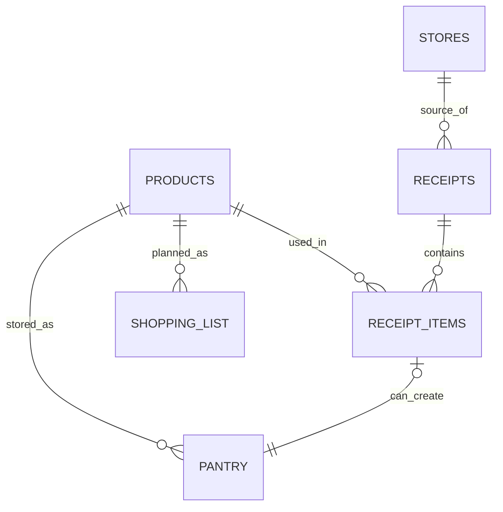

---
tags:
  - еда
  - schema
  - database
aliases:
  - Схема базы еды
  - DB Schema Food
---

# Schema

Это не просто набор папок, а маленькая локальная БД внутри Obsidian.

Главное правило:

1. каждая папка-таблица хранит записи одного типа;
2. каждая заметка внутри такой папки = одна запись;
3. дашборды и инструкции живут отдельно и не считаются данными.

---

## Карта проекта

### Таблицы

| Папка | Что это в терминах БД | Одна заметка = |
| --- | --- | --- |
| `Products/` | таблица товаров | один товар |
| `Stores/` | таблица магазинов | один магазин |
| `Receipts/` | таблица чеков | один чек |
| `Receipt Items/` | таблица позиций чека | одна позиция внутри чека |
| `Pantry/` | таблица домашних запасов | один текущий запас дома |
| `Shopping List/` | таблица планируемых покупок | один пункт списка покупок |

### Представления

| Файл | Что это |
| --- | --- |
| `Dashboard.md` | общая сводка по базе |
| `Что дома.md` | представление домашних запасов |
| `Что купить.md` | представление списка покупок |

### Шаблоны и автоматизация

| Папка/файл | Назначение |
| --- | --- |
| `Templates/` | шаблоны и точки входа для Templater |
| `resolver-config.json` | настройки локальной LLM и barcode resolver |

### Документация

| Файл | Назначение |
| --- | --- |
| `Index.md` | единая точка входа |
| `Docs/README.md` | общее описание проекта |
| `Docs/Schema.md` | схема БД |
| `Docs/Шпаргалка по категориям и единицам.md` | справочник значений |
| `Docs/Ручное добавление товара.md` | fallback-инструкция |
| `Docs/Будущая логика планирования.md` | backlog и идеи |

### Рабочие материалы

Это не core БД, а вспомогательные и рабочие материалы:

| Папка/файл | Статус |
| --- | --- |
| `Materials/Разработка/` | служебное |
| `Materials/Выгодные продукты.md` | рабочий документ |
| `Materials/Человеческий корм.md` | тематическая заметка |
| `Images/` | вложения/картинки |
| `items/` | не часть текущей основной схемы |

---

## Связи



---

## Смысл сущностей

### `Products`

Справочник товаров.

Запись отвечает на вопрос:

- что это за товар вообще?

Хранит только описание товара, а не историю цен по магазинам.

Основные поля:

- `title`
- `barcode`
- `category`
- `brand`
- `base_unit`
- `typical_pack_size`
- `typical_pack_unit`
- `perishable`
- `default_shelf_life_days`
- `price`

### `Stores`

Справочник магазинов.

Запись отвечает на вопрос:

- где куплен или где обычно покупается товар?

### `Receipts`

Журнал фактических покупок.

Запись отвечает на вопрос:

- когда и в каком магазине был этот чек?

### `Receipt Items`

Строки внутри чеков.

Запись отвечает на вопрос:

- какой товар, в каком количестве и по какой цене был куплен?

Именно здесь должна жить фактическая цена покупки.

### `Pantry`

Текущие домашние запасы.

Запись отвечает на вопрос:

- что прямо сейчас есть дома и сколько этого осталось?

### `Shopping List`

Планируемые покупки.

Запись отвечает на вопрос:

- что нужно купить в ближайший поход?

---

## Базовый поток данных

### Скан или ручное добавление нового товара

```text
штрихкод/название -> resolver -> Product
```

### Чек

```text
Receipt -> Receipt Items -> при необходимости Pantry
```

### Планирование

```text
Products + Pantry -> Shopping List
```

---

## Простая логика хранения

### Что где хранить

| Что ты хочешь сохранить | Куда писать |
| --- | --- |
| название товара | `Products` |
| штрихкод | `Products` |
| типичная упаковка | `Products` |
| ориентир по цене | `Products.price` |
| фактическая цена конкретной покупки | `Receipt Items.price_total` |
| магазин покупки | `Receipts` / `Receipt Items` |
| сколько есть дома | `Pantry.qty_current` |
| срок годности конкретного запаса | `Pantry.expires_on` |
| что нужно купить | `Shopping List` |

---

## Правило чтения папок

Чтобы не путаться, смотри на проект так:

1. `Products`, `Stores`, `Receipts`, `Receipt Items`, `Pantry`, `Shopping List` = таблицы
2. `Dashboard`, `Что дома`, `Что купить` = экраны
3. `Templates` = формы и команды
4. `Index`, `Docs/README`, `Docs/Schema`, `Docs/Шпаргалка`, `Docs/Будущая логика` = документация

Это и есть текущая архитектура в нормальном "бд-шном" виде.
