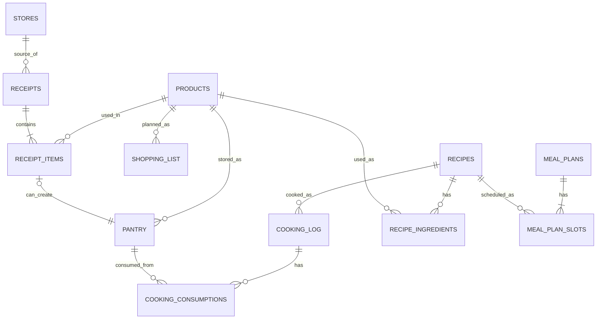

---
tags:
  - еда
  - schema
  - database
aliases:
  - Схема базы еды
  - DB Schema Food
---

# Schema

Это не просто набор папок, а маленькая локальная БД внутри Obsidian.

Главное правило:

1. каждая папка-таблица хранит записи одного типа;
2. каждая заметка внутри такой папки = одна запись;
3. дашборды и инструкции живут отдельно и не считаются данными.

---

## Карта проекта

### Таблицы

| Папка | Что это в терминах БД | Одна заметка = |
| --- | --- | --- |
| `Products/` | таблица товаров | один товар |
| `Recipes/` | таблица рецептов | один рецепт |
| `Stores/` | таблица магазинов | один магазин |
| `Receipts/` | таблица чеков | один чек |
| `Receipt Items/` | таблица позиций чека | одна позиция внутри чека |
| `Pantry/` | таблица домашних запасов | один текущий запас дома |
| `Cooking Log/` | журнал приготовлений | одно фактическое приготовление блюда |
| `Meal Plans/` | таблица планов питания | один месячный план питания |
| `Shopping List/` | таблица планируемых покупок | один пункт списка покупок |

### Логические связующие сущности

Это нормализующие сущности уровня модели данных. Сейчас часть из них еще может жить как встроенные таблицы внутри заметок, но в схеме они должны читаться именно как отдельные связи, а не как many-to-many напрямую.

| Сущность | Что связывает | Одна запись = |
| --- | --- | --- |
| `Recipe Ingredients` | `Recipes` <-> `Products` | один продукт внутри одного рецепта |
| `Meal Plan Slots` | `Meal Plans` <-> `Recipes` | один слот готовки в плане |
| `Cooking Consumptions` | `Cooking Log` <-> `Pantry` | одно списание одного запаса в одном приготовлении |

### Представления

| Файл | Что это |
| --- | --- |
| `Dashboard.md` | общая сводка по базе |
| `Рецепты.md` | представление базы рецептов |
| `Что дома.md` | представление домашних запасов |
| `Готовка.md` | журнал и обзор фактической готовки |
| `План питания.md` | обзор месячных планов питания |
| `Что купить.md` | представление списка покупок |

### Шаблоны и автоматизация

| Папка/файл | Назначение |
| --- | --- |
| `Templates/` | шаблоны и точки входа для Templater |
| `Projects/Еда/Templates/` | проектные шаблоны сущностей |
| `resolver-config.json` | настройки локальной LLM и barcode resolver |

### Документация

| Файл | Назначение |
| --- | --- |
| `Index.md` | единая точка входа |
| `Docs/README.md` | общее описание проекта |
| `Docs/Schema.md` | схема БД |
| `Docs/Шпаргалка по категориям и единицам.md` | справочник значений |
| `Docs/Ручное добавление товара.md` | fallback-инструкция |
| `Docs/Будущая логика планирования.md` | backlog и идеи |

### Рабочие материалы

Это не core БД, а вспомогательные и рабочие материалы:

| Папка/файл | Статус |
| --- | --- |
| `Materials/Разработка/` | служебное |
| `Materials/Выгодные продукты.md` | рабочий документ |
| `Materials/Человеческий корм.md` | тематическая заметка |
| `Images/` | вложения/картинки |
| `items/` | не часть текущей основной схемы |

---

## Связи



---

## Смысл сущностей

### `Products`

Справочник товаров.

Запись отвечает на вопрос:

- что это за товар вообще?

Хранит только описание товара, а не историю цен по магазинам.

Основные поля:

- `title`
- `barcode`
- `category`
- `brand`
- `store`
- `base_unit`
- `typical_pack_size`
- `typical_pack_unit`
- `perishable`
- `default_shelf_life_days`
- `price`
- `image`

### `Recipes`

Справочник рецептов.

Запись отвечает на вопрос:

- что именно готовим, из каких продуктов и на сколько порций?

Основные поля:

- `title`
- `dish_type`
- `servings`
- `total_time_min`
- `source`
- `products`
- `recipe_status`

### `Stores`

Справочник магазинов.

Запись отвечает на вопрос:

- где куплен или где обычно покупается товар?

### `Receipts`

Журнал фактических покупок.

Запись отвечает на вопрос:

- когда и в каком магазине был этот чек?

### `Receipt Items`

Строки внутри чеков.

Запись отвечает на вопрос:

- какой товар, в каком количестве и по какой цене был куплен?

Именно здесь должна жить фактическая цена покупки.

Чек без позиций в этой модели невалиден: если `Receipt` существует, у него должна быть минимум одна запись в `Receipt Items`.

### `Pantry`

Текущие домашние запасы.

Запись отвечает на вопрос:

- что прямо сейчас есть дома и сколько этого осталось?

Допустимо хранить не только целые упаковки, но и уже пересчитанный расходуемый остаток, например `750 г` вместо `0.75 упаковки`.

### `Cooking Log`

Журнал фактической готовки.

Запись отвечает на вопрос:

- что именно было приготовлено, когда и какие остатки были списаны?

### `Shopping List`

Планируемые покупки.

Запись отвечает на вопрос:

- что нужно купить в ближайший поход?

### `Meal Plans`

Планы питания на месяц.

Запись отвечает на вопрос:

- какие рецепты и в какие дни месяца планируется готовить?

### `Recipe Ingredients`

Связующая сущность между `Recipes` и `Products`.

Запись отвечает на вопрос:

- какой именно продукт входит в конкретный рецепт, в каком количестве и в какой единице?

Именно эта сущность убирает прямую many-to-many связь между рецептами и продуктами.

### `Meal Plan Slots`

Связующая сущность между `Meal Plans` и `Recipes`.

Запись отвечает на вопрос:

- какой рецепт запланирован на какую дату внутри конкретного месячного плана?

Именно эта сущность убирает прямую many-to-many связь между планами питания и рецептами.

### `Cooking Consumptions`

Связующая сущность между `Cooking Log` и `Pantry`.

Запись отвечает на вопрос:

- какой именно домашний запас был списан в рамках какого приготовления и в каком количестве?

Именно эта сущность убирает прямую many-to-many связь между готовкой и запасами.

---

## Базовый поток данных

### Скан или ручное добавление нового товара

```text
штрихкод/название -> resolver -> Product
```

### Чек

```text
Receipt -> Receipt Items -> при необходимости Pantry
```

### Планирование

```text
Recipes -> Meal Plan Slots -> Meal Plans
```

### Планирование покупок

```text
Meal Plans + Products + Pantry -> Shopping List
```

### Готовка

```text
Recipe -> Cooking Log -> Cooking Consumptions -> Pantry
```

---

## Простая логика хранения

### Что где хранить

| Что ты хочешь сохранить | Куда писать |
| --- | --- |
| название товара | `Products` |
| название рецепта | `Recipes` |
| штрихкод | `Products` |
| типичная упаковка | `Products` |
| состав рецепта | `Recipe Ingredients` |
| план питания на месяц | `Meal Plans` |
| конкретный день / слот внутри плана | `Meal Plan Slots` |
| факт приготовления | `Cooking Log` |
| списание конкретного запаса в готовке | `Cooking Consumptions` |
| ориентир по цене | `Products.price` |
| фактическая цена конкретной покупки | `Receipt Items.price_total` |
| магазин покупки | `Receipts` / `Receipt Items` |
| сколько есть дома | `Pantry.qty_current` |
| срок годности конкретного запаса | `Pantry.expires_on` |
| что нужно купить | `Shopping List` |

---

## Правило чтения папок

Чтобы не путаться, смотри на проект так:

1. `Products`, `Recipes`, `Stores`, `Receipts`, `Receipt Items`, `Pantry`, `Cooking Log`, `Meal Plans`, `Shopping List` = таблицы
2. `Dashboard`, `Рецепты`, `Что дома`, `Готовка`, `План питания`, `Что купить` = экраны
3. `Templates` = формы и команды
4. `Index`, `Docs/README`, `Docs/Schema`, `Docs/Шпаргалка`, `Docs/Будущая логика` = документация

Это и есть текущая архитектура в нормальном "бд-шном" виде.

Примечание: сейчас часть данных еще может редактироваться через встроенные таблицы внутри заметок `Recipes` и `Meal Plans`, а списания готовки могут жить прямо в заметке `Cooking Log`, но логическая схема уже должна читаться через связующие сущности, а не через прямые many-to-many связи.
