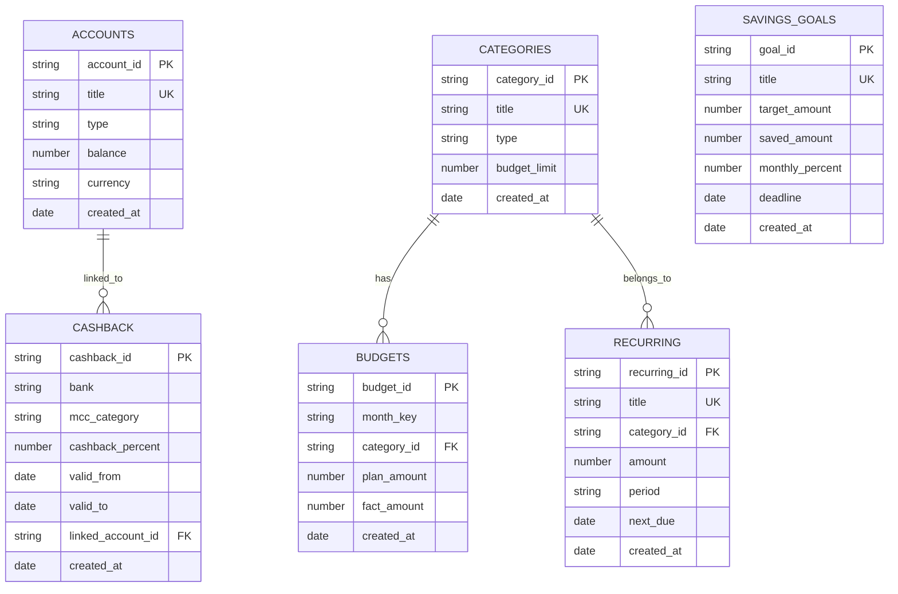

- Скормить нейронке [[Projects/Кошелек/Docs/Ideas.md]]
- Архитектура взаимодействия бота и гитхаба [[Projects/Кошелек/Docs/Architecture.md]]
- Задавать в рублях количество денег на продукты на месяц
- Задавать процент от ЗП который будет откладываться.
- Папка `Transactions/` — лишняя, пока нет автоматизации ввода (как `Receipts/` в кухне сейчас)
- `Accounts/`, `Categories/` — нужны как отдельные папки-таблицы
- Транзакции пока хранить в месячных файлах-дашбордах, позже вынесем в отдельные заметки когда будет авто-импорт
- При покупке одним чеком может быть такое, что какие-то товары относятся к покупкам питания, а какие-то к "побаловать себя". *Как разграничивать?*
- Разобраться со структурой проекта. Главная проблема это хранение транзакций в одном файле.
- 
# Структура проекта

```
Projects/Кошелек/
├── Кошелек.md                 # навигация-хаб
├── Docs/
│   ├── Schema.md              # схема БД, ER-диаграмма
│   └── README.md              # документация, как пользоваться
├── Accounts/                  # счета: карта/наличные/накопительный
│   └── <account>.md           # один счёт = одна заметка
├── Categories/                # справочник категорий расходов/доходов
│   └── <category>.md          # одна категория = одна заметка
├── Cashback/                  # кешбек-категории по банкам/картам
│   └── <cashback>.md          # одна программа кешбека = одна заметка
├── Budgets/                   # месячные бюджеты (план/факт)
│   └── YYYY-MM.md             # один месяц = одна заметка
├── Savings/                   # цели накоплений
│   └── <goal>.md              # одна цель = одна заметка
├── Recurring/                 # регулярные платежи (подписки, ЖКХ)
│   └── <recurring>.md         # один регулярный платёж = одна заметка
├── Monthly/                   # месячные дашборды с транзакциями (временное, до автоматизации)
│   └── YYYY-MM.md             # все транзакции месяца в таблицах
├── Templates/                 # Templater-шаблоны
│   ├── Новый счёт.md
│   ├── Новая категория.md
│   ├── Новая цель накоплений.md
│   ├── Новый регулярный платёж.md
│   ├── Новый месяц.md
│   └── scripts/               # JS-скрипты для Templater
│       ├── accounts.js
│       ├── categories.js
│       ├── budget.js
│       ├── savings.js
│       └── recurring.js
├── Views.md                   # dataview-представления (сводки, аналитика)
└── resolver-config.json       # настройки LLM для будущей авто-классификации
```

# ER Schema



# Сущности

### Account
Один счёт, карта или наличные.

Ключевые поля:
- `type: account`
- `title`
- `account_type` — карта/наличные/накопительный/вклад
- `balance` — текущий баланс
- `currency` — RUB/USD/EUR
- `bank` — название банка
- `cashback_account` — привязанная программа кешбека (ссылка)

### Category
Категория расходов или доходов.

Ключевые поля:
- `type: category`
- `title`
- `category_type` — expense/income
- `budget_limit` — лимит на месяц (руб)
- `icon` — эмодзи для отображения
- `parent_category` — родительская категория (для иерархии)

### Cashback
Программа кешбека банка.

Ключевые поля:
- `type: cashback`
- `bank`
- `account_id` — привязанный счёт
- `categories` — список MCC-категорий с процентом
- `valid_from` / `valid_to` — период действия
- `cashback_currency` — рубли/баллы/мили

### Budget
Месячный бюджет по категориям.

Ключевые поля:
- `type: budget`
- `month_key` — YYYY-MM
- `total_plan` — общий план расходов
- `total_fact` — факт расходов
- `category_budgets` — таблица: категория, план, факт, остаток
- `food_budget` — отдельный лимит на продукты (из TODO)
- `savings_percent` — процент от ЗП в накопления (из TODO)

### Savings Goal
Цель накоплений.

Ключевые поля:
- `type: savings_goal`
- `title`
- `target_amount`
- `saved_amount`
- `monthly_contribution` — сколько откладывать в месяц
- `monthly_percent` — процент от ЗП
- `deadline`
- `progress` — вычисляемое поле

### Recurring Payment
Регулярный платёж.

Ключевые поля:
- `type: recurring`
- `title`
- `category_id`
- `amount`
- `period` — monthly/quarterly/yearly
- `next_due` — следующая дата списания
- `auto_pay` — автоплатёж вкл/выкл

# Data Flow

### Новая транзакция (ручной режим, пока в Monthly)
```text
Monthly/YYYY-MM.md -> таблица расходов/доходов -> обновляет Budgets fact_amount
```

### Месячный бюджет
```text
Budgets/YYYY-MM.md <- Categories.budget_limit + Savings.monthly_percent
```

### Кешбек
```text
Cashback -> учитывается при расчёте факта расходов в Budgets
```

### Регулярные платежи
```text
Recurring -> при наступлении next_due создаёт запись в Monthly/YYYY-MM.md
```

### Накопления
```text
Savings.monthly_percent от доходов -> Savings.saved_amount += contribution
```

# Business Rules

1. Транзакции пока живут в `Monthly/YYYY-MM.md` как таблицы, до автоматизации ввода
2. Когда будет авто-импорт (выписки, API банка) — каждая транзакция станет отдельной заметкой в `Transactions/`
3. Бюджет без категорий невалиден — минимум одна запись в category_budgets
4. `food_budget` в Budgets связан с `Projects/Кухня/План питания.md` — лимит на продукты единый
5. Кешбек считается как возврат, уменьшает факт расходов в Budgets
6. Процент накоплений задаётся в Savings и применяется к доходам месяца
7. Регулярные платежи с `auto_pay: true` учитываются в бюджете автоматически

# Следующие шаги

- [ ] Создать структуру папок
- [ ] Написать Schema.md
- [ ] Написать README.md
- [ ] Создать шаблоны Templater
- [ ] Создать первые записи Accounts, Categories
- [ ] Создать Budget на текущий месяц
- [ ] Настроить Views.md с dataview-запросами
- [ ] Подготовить resolver-config.json для будущей LLM-классификации
- [ ] Продумать механизм импорта банковских выписок 