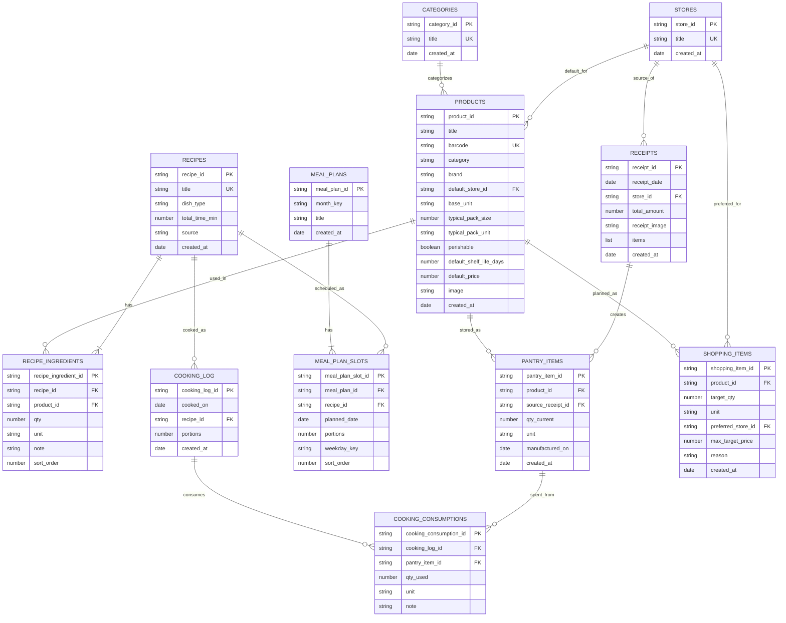

---
tags:
  - еда
  - schema
  - database
aliases:
  - Схема базы еды
  - DB Schema Food
---

# Schema

Это нормализованная схема food-проекта в терминах БД.

Canvas-версия: [[Schema.canvas]]

Главный принцип чтения:

1. каждая папка-таблица хранит записи одного типа;
2. каждая заметка внутри такой папки = одна строка таблицы;
3. прямых many-to-many в логической схеме нет;
4. связи many-to-many всегда раскладываются через отдельные связующие таблицы.

---

## Карта проекта

### Физические таблицы

| Папка            | Таблица          | Одна заметка =         |
| ---------------- | ---------------- | ---------------------- |
| `Products/`      | `products`       | один товар             |
| `Categories/`    | `categories`     | одна категория товаров |
| `Recipes/`       | `recipes`        | один рецепт            |
| `Stores/`        | `stores`         | один магазин           |
| `Receipts/`      | `receipts`       | один чек               |
| `Pantry/`        | `pantry_items`   | один домашний запас    |
| `Cooking Log/`   | `cooking_log`    | одно событие готовки   |
| `Meal Plans/`    | `meal_plans`     | один месячный план     |
| `Shopping List/` | `shopping_items` | один пункт покупки     |

### Логические связующие таблицы

Сейчас часть этих данных еще может жить как встроенные таблицы или секции внутри заметок, но в схеме БД это именно отдельные таблицы связей.

| Таблица | Что связывает | Одна запись = |
| --- | --- | --- |
| `recipe_ingredients` | `recipes` <-> `products` | один продукт в одном рецепте |
| `meal_plan_slots` | `meal_plans` <-> `recipes` | один слот плана на одну дату |
| `cooking_consumptions` | `cooking_log` <-> `pantry_items` | одно списание одного запаса |

---

## ER Schema



---

## Tables

### `products`

Справочник товаров.

| Поле                      | Тип     | Null | Ключ              | Смысл                  |
| ------------------------- | ------- | ---- | ----------------- | ---------------------- |
| `product_id`              | string  | нет  | PK                | идентификатор товара   |
| `title`                   | string  | нет  |                   | название товара        |
| `barcode`                 | string  | да   | UK                | штрихкод               |
| `category`                | string  | нет  |                   | категория              |
| `brand`                   | string  | да   |                   | бренд                  |
| `default_store_id`        | string  | да   | FK -> `stores.store_id` | магазин по умолчанию   |
| `base_unit`               | string  | нет  |                   | базовая единица учета  |
| `typical_pack_size`       | number  | да   |                   | типичная фасовка       |
| `typical_pack_unit`       | string  | да   |                   | единица фасовки        |
| `perishable`              | boolean | нет  |                   | скоропорт              |
| `default_shelf_life_days` | number  | да   |                   | типичный срок годности |
| `default_price`           | number  | да   |                   | опорная цена           |
| `image`                   | string  | да   |                   | картинка               |
| `created_at`              | date    | нет  |                   | дата создания          |

### `stores`

Справочник магазинов.

| Поле         | Тип    | Null | Ключ | Смысл                  |
| ------------ | ------ | ---- | ---- | ---------------------- |
| `store_id`   | string | нет  | PK   | идентификатор магазина |
| `title`      | string | нет  | UK   | название магазина      |
| `created_at` | date   | нет  |      | дата создания          |

### `categories`

Справочник категорий товаров.

| Поле         | Тип    | Null | Ключ | Смысл                   |
| ------------ | ------ | ---- | ---- | ----------------------- |
| `category_id`| string | нет  | PK   | идентификатор категории |
| `title`      | string | нет  | UK   | название категории      |
| `created_at` | date   | нет  |      | дата создания           |

### `recipes`

Справочник рецептов.

| Поле               | Тип    | Null | Ключ | Смысл                              |
| ------------------ | ------ | ---- | ---- | ---------------------------------- |
| `recipe_id`        | string | нет  | PK   | идентификатор рецепта              |
| `title`            | string | нет  | UK   | название рецепта                   |
| `dish_type`        | string | да   |      | тип блюда                          |
| `total_time_min`   | number | да   |      | время приготовления                |
| `source`           | string | да   |      | источник                           |
| `created_at`       | date   | нет  |      | дата создания                      |

### `recipe_ingredients`

Связующая таблица между рецептами и товарами.

| Поле         | Тип    | Null | Ключ                | Смысл                |
| ------------ | ------ | ---- | ------------------- | -------------------- |
| `recipe_ingredient_id` | string | нет  | PK                  | идентификатор строки |
| `recipe_id`           | string | нет  | FK -> `recipes.recipe_id`  | рецепт               |
| `product_id`          | string | нет  | FK -> `products.product_id` | товар                |
| `qty`        | number | нет  |                     | количество           |
| `unit`       | string | нет  |                     | единица              |
| `note`       | string | да   |                     | примечание           |
| `sort_order` | number | да   |                     | порядок в рецепте    |

### `receipts`

Журнал чеков.

| Поле            | Тип    | Null | Ключ              | Смысл                      |
| --------------- | ------ | ---- | ----------------- | -------------------------- |
| `receipt_id`    | string | нет  | PK                | идентификатор чека         |
| `receipt_date`  | date   | нет  |                   | дата чека                  |
| `store_id`      | string | нет  | FK -> `stores.store_id` | магазин                    |
| `total_amount`  | number   | да   |                   | сумма чека                 |
| `receipt_image` | string   | да   |                   | фото чека                  |
| `items`         | list     | нет  |                   | позиции чека (вложенный массив: product, qty, price, unit) |
| `created_at`    | date     | нет  |                   | дата создания              |

### `pantry_items`

Домашние запасы.

| Поле                     | Тип    | Null | Ключ                     | Смысл                |
| ------------------------ | ------ | ---- | ------------------------ | -------------------- |
| `pantry_item_id`         | string | нет  | PK                       | идентификатор запаса |
| `product_id`             | string | нет  | FK -> `products.product_id`      | товар                |
| `source_receipt_id`      | string | да   | FK -> `receipts.receipt_id` | источник из чека     |
| `qty_current`            | number | нет  |                          | текущий остаток      |
| `unit`                   | string | нет  |                          | единица остатка      |
| `manufactured_on`        | date   | да   |                          | дата изготовления    |
| `created_at`             | date   | нет  |                          | дата создания        |

### `meal_plans`

Месячные планы питания.

| Поле         | Тип    | Null | Ключ | Смысл               |
| ------------ | ------ | ---- | ---- | ------------------- |
| `meal_plan_id` | string | нет  | PK   | идентификатор плана |
| `month_key`  | string | нет  |      | месяц вида YYYY-MM  |
| `title`      | string | нет  |      | название плана      |
| `created_at` | date   | нет  |      | дата создания       |

### `meal_plan_slots`

Слоты внутри месячного плана.

| Поле           | Тип    | Null | Ключ                  | Смысл               |
| -------------- | ------ | ---- | --------------------- | ------------------- |
| `meal_plan_slot_id` | string | нет  | PK                    | идентификатор слота |
| `meal_plan_id`      | string | нет  | FK -> `meal_plans.meal_plan_id` | план                |
| `recipe_id`         | string | нет  | FK -> `recipes.recipe_id`    | рецепт              |
| `planned_date` | date   | нет  |                       | дата готовки        |
| `portions`     | number | нет  |                       | сколько порций      |
| `weekday_key`  | string | нет  |                       | день недели         |
| `sort_order`   | number | да   |                       | порядок слота       |

### `cooking_log`

Фактическая готовка.

| Поле         | Тип    | Null | Ключ               | Смысл                 |
| ------------ | ------ | ---- | ------------------ | --------------------- |
| `cooking_log_id` | string | нет  | PK                 | идентификатор готовки |
| `cooked_on`  | date   | нет  |                    | дата готовки          |
| `recipe_id`  | string | нет  | FK -> `recipes.recipe_id` | приготовленный рецепт |
| `portions`   | number | нет  |                    | сколько порций        |
| `created_at` | date   | нет  |                    | дата создания         |

### `cooking_consumptions`

Списания запасов в рамках готовки.

| Поле             | Тип    | Null | Ключ                    | Смысл                  |
| ---------------- | ------ | ---- | ----------------------- | ---------------------- |
| `cooking_consumption_id` | string | нет  | PK                      | идентификатор списания |
| `cooking_log_id`         | string | нет  | FK -> `cooking_log.cooking_log_id`  | событие готовки        |
| `pantry_item_id`         | string | нет  | FK -> `pantry_items.pantry_item_id` | конкретный запас       |
| `qty_used`       | number | нет  |                         | сколько списано        |
| `unit`           | string | нет  |                         | единица списания       |
| `note`           | string | да   |                         | пояснение              |


### `shopping_items`

Планируемые покупки.

| Поле | Тип | Null | Ключ | Смысл |
| --- | --- | --- | --- | --- |
| `shopping_item_id` | string | нет | PK | идентификатор пункта |
| `product_id` | string | нет | FK -> `products.product_id` | товар |
| `target_qty` | number | нет |  | сколько купить |
| `unit` | string | нет |  | единица |
| `preferred_store_id` | string | да | FK -> `stores.store_id` | желательный магазин |
| `max_target_price` | number | да |  | потолок цены |
| `reason` | string | да |  | причина покупки |
| `created_at` | date | нет |  | дата создания |

---

## Data Flow

### Новый товар

```text
штрихкод / название -> products
```

### Чек

```text
receipts -> pantry_items
```

### Рецепт

```text
recipes -> recipe_ingredients -> products
```

Все количества в `recipe_ingredients` задаются на 1 порцию. Это системное правило модели, а не отдельное поле в `recipes`.

### План питания

```text
meal_plans -> meal_plan_slots -> recipes
```

### Готовка

```text
cooking_log -> cooking_consumptions -> pantry_items
```

### Покупки под план

```text
meal_plan_slots + recipe_ingredients + pantry_items -> shopping_items
```

---

## Business Rules

1. `receipts` без `items` невалиден.
2. Прямых many-to-many связей в схеме нет.
3. Состав рецепта хранится через `recipe_ingredients`.
4. Любой рецепт по определению хранится на 1 порцию; отдельное поле базового числа порций в `recipes` не нужно.
5. Все ингредиенты рецепта задаются на 1 порцию; в `meal_plan_slots` и `cooking_log` хранится только итоговое число порций.
6. Расписание плана хранится через `meal_plan_slots`.
7. Списание запасов хранится через `cooking_consumptions`.
8. `pantry_items` может хранить уже пересчитанный расходуемый остаток, а не только целую упаковку.
9. Срок годности лучше вычислять из `manufactured_on + products.default_shelf_life_days`, а не хранить как отдельное поле.
10. История фактических цен живет в `receipts.items`.

---

## Mapping To Vault

| Что в БД | Где сейчас в vault |
| --- | --- |
| `products` | `Projects/Кухня/Products/` |
| `recipes` | `Projects/Кухня/Recipes/` |
| `stores` | `Projects/Кухня/Stores/` |
| `receipts` | `Projects/Кухня/Receipts/` |
| `pantry_items` | `Projects/Кухня/Pantry/` |
| `meal_plans` | `Projects/Кухня/Meal Plans/` |
| `cooking_log` | `Projects/Кухня/Cooking Log/` |
| `shopping_items` | `Projects/Кухня/Shopping List/` |
| `recipe_ingredients` | пока встроенная таблица `Ингредиенты` в `Recipes/*.md` |
| `meal_plan_slots` | пока таблица `Расписание` в `Meal Plans/*.md` |
| `cooking_consumptions` | пока секция списаний в `Cooking Log/*.md` |

---

## Note

Сейчас реализация еще не везде физически доведена до этой схемы: часть логических таблиц живет внутри заметок как вложенные таблицы или секции. Но целевая модель БД именно такая, и новые скрипты лучше проектировать уже под нее.

---

## TODO / Известные проблемы

- **Pantry items удаляются при расходовании** → связь `receipt → покупка` теряется.  
  История цен и дат покупки остаётся только в markdown-таблице чека. Если понадобится восстановить цепочку `чек → позиция → дата → цена`, можно искать по названию продукта в `Receipts/`.  
  *Trade-off принят:* через год в `Pantry/` не будет сотен мёртвых заметок.
