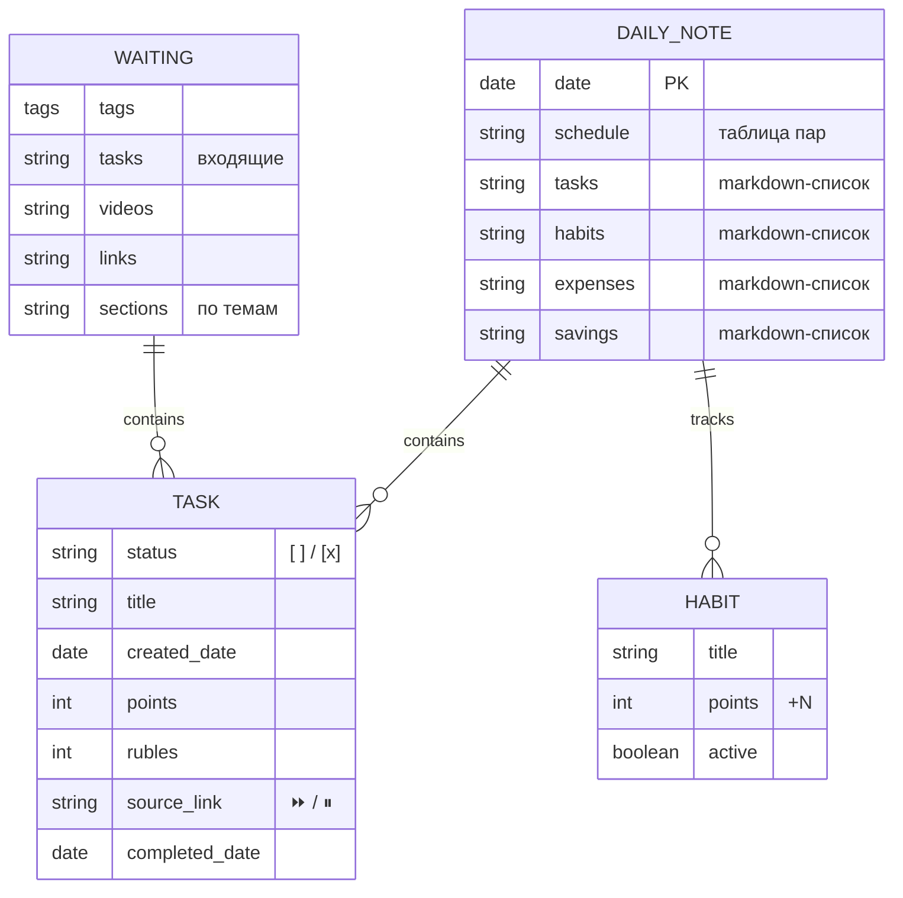

---
tags:
  - задачи
  - schema
aliases:
  - Схема задач
  - Task Schema
---

# Schema — Рабочий стол

Нормализованная схема системы задач в терминах БД.

---

## Физические таблицы

| Папка | Таблица | Одна заметка = |
| --- | --- | --- |
| `Tasks/Daily/` | `daily_notes` | один день |
| `Tasks/Waiting/` | `waiting` | inbox-файл (единственная строка-файл) |
| `Tasks/.qwen-task-rules.md` | `rules` | конфиг оценки (AI-контекст) |
| `Projects/Рабочий стол/Habits/List.md` | `habits` | мастер-список ежедневных привычек |

---

## Структура `daily_notes`

```yaml
---
date: YYYY-MM-DD
---
```

### Секции внутри файла

| Секция | Назначение |
| --- | --- |
| `Расписание` | Учебные пары (таблица) |
| `Задачи на сегодня` | Активные `- [ ] задача (+N)` |
| `Перенесенные задачи` | Задачи из прошлых дней (auto-insert) |
| `Привычки` | Ежедневные чекбоксы привычек из `Habits/List.md` |
| `Общий прогресс` | Dataview: задачи + привычки + рубли |
| `Траты` | Расходы дня |
| `Накопления` | Сбережения / цели |

---

## Формат задачи (task_line)

```
- [ ] <текст> [➕ YYYY-MM-DD] [(+N)] [⏩ из [[source\|alias]]] [⏸ из [[source\|alias]]] [✅ YYYY-MM-DD]
```

### Поля

| Поле | Регулярка | Описание |
| --- | --- | --- |
| `status` | `^\s*[-*]\s\[([xX ])\]` | ` ` — открыта, `x` — выполнена |
| `title` | `\]\s+(.+?)(?:\s+[➕⏩⏸✅(])` | текст задачи |
| `created` | `➕\s+(\d{4}-\d{2}-\d{2})` | дата создания |
| `points` | `\(\+(\d+)\)` | баллы за выполнение |
| `rubles` | `\(\+(\d+)р\)` | рублёвая оценка (курс 5% → баллы) |
| `postponed_from` | `⏩ из \[\[([^\]]+)\]`| перенесена из daily |
| `waiting_from` | `⏸ из \[\[([^\]]+)\]` | перенесена из waiting |
| `completed` | `✅\s+(\d{4}-\d{2}-\d{2})` | дата выполнения |

---

## ER Schema



---

## Логика простановки баллов

1. AI читает `.qwen-task-rules.md`
2. Анализирует контекст задачи (сложность, объём, тип)
3. Добавляет `(+N)` или `(+Nр)` к строке
4. НЕ меняет `[ ]` на `[x]`
5. НЕ добавляет `✅`

### Категории оценки

| Тип | Диапазон |
| --- | --- |
| Рутина | +5 – +15 |
| Учебные | +15 – +50 |
| Технические | +10 – +25 |
| Проекты | +20 – +50 |
| Организация | +10 – +25 |
| Привычки | +5 – +20 |
| Работа/заработок | по сумме |

---

## Dataview-прогресс

```dataviewjs
const taskRegex = /-\s?\[([xX ])\].*?\(\+(\d+)\)/g;
const rubleRegex = /-\s?\[([xX ])\].*?\(\+(\d+)р\)/g;
// ...считает completed/total, рисует бар
```

---

## Интеграция postpone-task

| Команда | Хоткей | Действие |
| --- | --- | --- |
| move-current-task | `Ctrl+Shift+Enter` | Модалка: На завтра / В отложенные |

### Алгоритм

1. Валидация: `^\s*[-*]\s\[[ ]]\s+.+$`
2. Выбор цели (SuggestModal → Modal с кнопками)
3. **На завтра:**
   - Вычислить `basename + 1 день`
   - Вставить в `Tasks/Daily/<завтра>.md` → секция `## Перенесенные задачи`
   - Добавить `⏩ из [[Tasks/Daily/<сегодня>\|<сегодня>]]`
   - Удалить из исходного файла
4. **В отложенные:**
   - Вставить в `Tasks/Waiting.md` → секция `## Входящие`
   - Добавить `⏸ из [[source\|basename]]`
   - Удалить из исходного файла

---

## Правила именования

- Ежедневные: `YYYY-MM-DD.md`
- Баллы: целые числа, без пробела перед `(+N)`
- Ссылки-источники: wiki-ссылки с alias-датой
